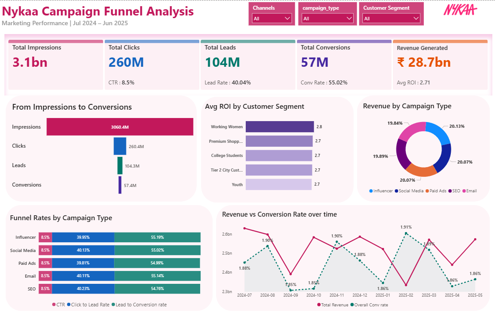

# Nykaa Campaign Funnel Analysis
<p align="center">
  
</p>


> Analyzing marketing campaign performance across the full funnel — from impressions to conversions — for Nykaa's multi-channel campaigns between July 2024 and June 2025.

---

## 1. Project Background

Nykaa is one of India's leading beauty and lifestyle e-commerce platforms, running large-scale marketing campaigns across multiple digital channels simultaneously — including Influencer, Social Media, Paid Ads, SEO, and Email.

With campaigns running across different audience segments, languages, durations, and channels, understanding which combinations actually drive conversions — and where the funnel is leaking — is a critical business problem.

This project uses SQL for all data cleaning, transformation, and analysis, and Power BI for funnel visualization and campaign performance reporting.

As a fresher data analyst, I chose this dataset because funnel analysis is one of the most in-demand skills in digital marketing analytics — and Nykaa's multi-channel, multi-segment campaign structure offered a realistic and complex environment to practice it.

---

## 2. Data Structure & Initial Checks

**Table:** `nykaa_campaigns`
**Rows:** ~15,000+ campaigns | **Columns:** 24 (original) + 8 calculated
**Each row:** One marketing campaign record

---

<details>
<summary><b>Column Reference</b></summary>

<br>

| Column | Data Type | Description |
|--------|-----------|-------------|
| `campaign_id` | VARCHAR | Unique campaign identifier |
| `campaign_type` | VARCHAR | Influencer / Social Media / Paid Ads / SEO / Email |
| `target_audience` | VARCHAR | Audience targeted by the campaign |
| `campaign_duration` | SMALLINT | Duration of campaign in days |
| `duration_bucket` | VARCHAR | Short / Medium / Long duration label |
| `channel_used` | VARCHAR | Platform or channel used |
| `impressions` | BIGINT | Total number of impressions served |
| `clicks` | BIGINT | Total clicks received |
| `total_leads` | BIGINT | Total leads generated |
| `total_conversions` | BIGINT | Total conversions achieved |
| `total_revenue` | BIGINT | Revenue generated by campaign |
| `acquisition_cost` | NUMERIC | Cost to acquire customers |
| `roi` | NUMERIC | Return on investment |
| `campaign_language` | VARCHAR | Language used in campaign |
| `engagement_score` | NUMERIC | Engagement quality score |
| `customer_segment` | VARCHAR | Working Women / Premium Shoppers / College Students / Tier 2 City Customers / Youth |
| `date_raw` | VARCHAR | Raw date string (DD-MM-YYYY format) |
| `is_instagram` | SMALLINT | Binary flag — 1 if Instagram was used |
| `is_youtube` | SMALLINT | Binary flag — 1 if YouTube was used |
| `is_whatsapp` | SMALLINT | Binary flag — 1 if WhatsApp was used |
| `is_facebook` | SMALLINT | Binary flag — 1 if Facebook was used |
| `is_google` | SMALLINT | Binary flag — 1 if Google was used |
| `is_email` | SMALLINT | Binary flag — 1 if Email was used |

</details>

---

<details>
<summary><b>Calculated Columns Added</b></summary>

<br>

| Column | Formula | Description |
|--------|---------|-------------|
| `campaign_date` | `TO_DATE(date_raw, 'DD-MM-YYYY')` | Proper DATE column for time-based queries |
| `campaign_month` | `TO_CHAR(campaign_date, 'YYYY-MM')` | Month label for monthly grouping |
| `ctr` | `clicks / impressions` | Click-through rate |
| `click_to_lead` | `total_leads / clicks` | Clicks to leads conversion rate |
| `lead_to_conv` | `total_conversions / total_leads` | Leads to conversions rate |
| `overall_conv` | `total_conversions / impressions` | End-to-end funnel conversion rate |
| `cost_per_conv` | `acquisition_cost / total_conversions` | Cost to achieve one conversion |
| `revenue_per_conv` | `total_revenue / total_conversions` | Revenue generated per conversion |

</details>

---

<details>
<summary><b>Initial Checks Performed</b></summary>

<br>

- Verified row count and distinct campaign IDs to check for duplicates in the primary key
- Checked NULL values in all critical columns — impressions, clicks, leads, conversions, revenue
- Used `COUNT(DISTINCT ...)` to confirm exact number of campaign types, channels, languages, and customer segments
- Added `campaign_date` DATE column since `date_raw` was stored as TEXT and could not support date queries
- Extracted `campaign_month` for monthly trend grouping
- Added 6 calculated funnel metric columns using `NULLIF` to prevent division-by-zero errors
- Confirmed all 5 campaign types and all customer segments were clean with no spelling inconsistencies

</details>

---

## 3. Problem Statement

Nykaa runs campaigns across 5 campaign types, multiple channels, and 5 distinct customer segments simultaneously. Despite generating 3.1 billion impressions, only 57 million conversions were achieved — meaning over 98% of people who saw a Nykaa campaign did not convert.

The business needs to understand exactly where in the funnel people are dropping off, which campaign types and segments are performing efficiently, and whether campaign duration or channel selection are driving meaningful differences in outcome.

This analysis was built to answer:

- Where is the biggest drop-off in the funnel — impressions to clicks, clicks to leads, or leads to conversions?
- Which campaign type converts best end-to-end?
- Which customer segment has the highest lead-to-conversion rate?
- Does campaign duration affect conversion performance?
- Which channels are most efficient for driving conversions?
- Is revenue growth consistent month over month?

---

## 4. Key Insights

| # | Insight | Finding |
|---|---------|---------|
| 1 | **Stage 1 is where 91% of the audience drops off** | CTR of 8.5% means only 1 in 12 people who see an ad actually click it |
| 2 | **Once users click, the funnel performs well** | Click-to-Lead rate of 40% and Lead-to-Conversion rate of 55% are both strong |
| 3 | **All 5 campaign types have identical CTR** | Every type shows exactly 8.5% CTR — the awareness stage is uniformly weak |
| 4 | **Revenue is evenly split across campaign types** | Influencer (20.13%), Social Media (20.07%), Paid Ads (20.07%), SEO (19.89%), Email (19.84%) |
| 5 | **Working Women segment leads ROI** | Highest avg ROI of 2.8 compared to 2.7 across all other segments |
| 6 | **Revenue and conversion rate trend move independently** | Revenue fluctuates while overall conversion rate stays relatively stable — volume is the driver |

---

## 5. Insight Deep Dive

> Click each insight to expand the full analysis

---

<details>
<summary><b>Insight 1 — Stage 1 is the Biggest Funnel Leak: 91.5% Drop-off at Click</b></summary>

<br>

**Chart: From Impressions to Conversions (Funnel Bar Chart)**

| Funnel Stage | Volume | Rate |
|-------------|--------|------|
| Impressions | 3,060.4M | — |
| Clicks | 260.4M | 8.5% CTR |
| Leads | 104.3M | 40.04% Click-to-Lead |
| Conversions | 57.4M | 55.02% Lead-to-Conv |

The funnel shows a clear pattern: the first stage (Impression → Click) is where the overwhelming majority of the audience is lost. Only 8.5% of people who see a Nykaa campaign click on it.

However, once a user clicks, the funnel performs remarkably well — 40% of clicks become leads and 55% of leads convert. This means the product and landing experience are working — the problem is purely at the awareness and attention stage.

The SQL analysis confirmed this directly:
```sql
-- Q8 result showed CTR at 8.51% with 91% dropout at Stage 1
```

> **Key Takeaway:** Nykaa does not have a conversion problem — it has a click problem. Improving ad creative quality and targeting precision at the top of the funnel would have the highest impact on total conversions.

</details>

---

<details>
<summary><b>Insight 2 — All Campaign Types Have Identical CTR of 8.5%</b></summary>

<br>

**Chart: Funnel Rates by Campaign Type (Grouped Bar Chart)**

| Campaign Type | CTR | Click-to-Lead | Lead-to-Conv |
|--------------|-----|--------------|-------------|
| Influencer | 8.5% | 39.95% | 55.19% |
| Social Media | 8.5% | 40.13% | 55.02% |
| Paid Ads | 8.5% | 39.81% | 54.99% |
| Email | 8.5% | 40.11% | 55.14% |
| SEO | 8.5% | 40.23% | 54.76% |

Every single campaign type has exactly the same CTR of 8.5% — which is statistically unusual and suggests the audience-level drop-off is a platform-wide issue rather than a campaign-type issue.

The differentiation only appears at the Click-to-Lead and Lead-to-Conversion stages, where SEO leads on Click-to-Lead (40.23%) and Email leads on Lead-to-Conversion (55.14%).

> **Key Takeaway:** No campaign type has a structural advantage at the awareness stage. Investments to improve CTR need to be applied across all types simultaneously, not targeted at one specific channel.

</details>

---

<details>
<summary><b>Insight 3 — Revenue Is Distributed Almost Equally Across All Campaign Types</b></summary>

<br>

**Chart: Revenue by Campaign Type (Donut Chart)**

| Campaign Type | Revenue Share |
|-------------|--------------|
| Influencer | 20.13% |
| Social Media | 20.07% |
| Paid Ads | 20.07% |
| SEO | 19.89% |
| Email | 19.84% |

The near-perfect equal distribution of revenue across all 5 campaign types — each sitting within 0.3% of each other — tells a clear story: no single channel is outperforming the others by a meaningful margin.

Total revenue of ₹28.7 billion with an average ROI of 2.71 across all campaigns confirms the overall marketing operation is profitable, but efficiency gains remain untapped.

> **Key Takeaway:** Budget diversification across all channels is appropriate given equal performance, but this also means there is no clearly dominant channel to double down on. Improving CTR universally would lift all channels equally.

</details>

---

<details>
<summary><b>Insight 4 — Working Women Segment Has the Highest ROI</b></summary>

<br>

**Chart: Avg ROI by Customer Segment (Horizontal Bar Chart)**

| Customer Segment | Avg ROI |
|----------------|---------|
| Working Women | **2.8** |
| Premium Shoppers | 2.7 |
| College Students | 2.7 |
| Tier 2 City Customers | 2.7 |
| Youth | 2.7 |

The Working Women segment returns the highest average ROI at 2.8 — marginally above the 2.7 seen across all other segments. While the gap is small, at the scale of ₹28.7 billion in revenue, even a 0.1 ROI improvement represents significant additional value.

The SQL analysis (Q11) further showed that lead-to-conversion rates also vary across segments, providing a basis for prioritizing budget allocation.

> **Key Takeaway:** Working Women is the most efficient segment to target for ROI. Increasing budget allocation toward this segment while maintaining presence in others is a low-risk optimization.

</details>

---

<details>
<summary><b>Insight 5 — Revenue Fluctuates But Conversion Rate Stays Stable</b></summary>

<br>

**Chart: Revenue vs Conversion Rate Over Time (Dual Line Chart)**

The time series chart from October 2024 to May 2025 shows two distinct patterns:

- **Total Revenue** fluctuates significantly — ranging from ₹2.3bn to ₹2.6bn per month with no consistent growth trend
- **Overall Conversion Rate** remains relatively stable — moving narrowly between 1.85% and 1.91%

This divergence means that revenue swings are driven by changes in impression volume (campaign spend), not by improvements or declines in funnel efficiency. When more budget is spent on impressions, revenue goes up — not because the funnel got better, but because more people entered it.

> **Key Takeaway:** The funnel is consistent and stable — but passive. Revenue growth is currently volume-dependent. To achieve scalable growth without proportionally increasing spend, the CTR at Stage 1 must be improved.

</details>

---

## 6. Recommendations

<details>
<summary><b>Rec 1 — Prioritize Creative Quality to Fix the 91.5% Stage 1 Drop-off</b></summary>

<br>

The single highest-impact improvement available is increasing the CTR from 8.5% to even 10–11%. Given the funnel's strong downstream performance, every additional click that enters the funnel has a 40% chance of becoming a lead and a 55% chance of that lead converting.

**Steps to address it:**
- A/B test ad creatives across all 5 campaign types to identify which visuals and copy styles drive higher click rates
- Segment ad creative by customer audience — Working Women, Youth, and College Students likely respond to different visual styles and messaging tones
- Review the lowest CTR campaigns individually to identify common patterns in underperforming creatives

</details>

---

<details>
<summary><b>Rec 2 — Increase Budget Allocation Toward the Working Women Segment</b></summary>

<br>

With the highest ROI of 2.8 and strong conversion metrics, the Working Women segment is the most capital-efficient audience to target. Shifting even 5–10% of budget from lower-performing segments into this one would improve overall campaign ROI.

**Steps to address it:**
- Run a dedicated campaign cohort targeting Working Women exclusively across the top 3 channels
- Monitor whether the higher ROI holds at increased budget scale or whether it diminishes
- Use the SQL segment analysis (Q11) to track lead-to-conversion rate quarterly as budget shifts

</details>

---

<details>
<summary><b>Rec 3 — Leverage Email and SEO for Lower-Funnel Efficiency</b></summary>

<br>

Email campaigns show the highest Lead-to-Conversion rate (55.14%) and SEO shows the highest Click-to-Lead rate (40.23%). These two channels are outperforming others at the bottom and middle of the funnel respectively.

**Steps to address it:**
- Use Email campaigns specifically for retargeting leads who have already clicked but not yet converted
- Invest in SEO content that targets high-intent keywords — users arriving via SEO are already showing purchase intent, explaining the higher click-to-lead rate
- Combine SEO for lead generation with Email for conversion — a two-stage channel strategy

</details>

---

<details>
<summary><b>Rec 4 — Reduce Revenue Volatility by Stabilizing Monthly Campaign Spend</b></summary>

<br>

Revenue fluctuates month-to-month because it is directly tied to impression volume rather than funnel efficiency. Months with higher spend produce higher revenue — but this creates unpredictable revenue patterns.

**Steps to address it:**
- Set a consistent monthly impression budget floor to prevent low-revenue dips
- Track Revenue per Impression as a KPI to measure whether funnel improvements are translating into better capital efficiency over time
- Identify the months with the sharpest revenue dips and investigate whether they correspond to reduced spend, seasonal audience disengagement, or creative fatigue

</details>

---

## 7. Tools & Technologies

<details>
<summary><b>View full tool breakdown</b></summary>

<br>

| Tool | Purpose |
|------|---------|
| **PostgreSQL** | Database setup, data cleaning, calculated columns, and all funnel analysis queries |
| **Power BI** | Dashboard design, funnel visualization, KPI cards, and time series charts |
| **SQL — DDL** | `CREATE TABLE`, `ALTER TABLE` for schema design and adding calculated columns |
| **SQL — DML** | `UPDATE` statements to populate campaign_date, campaign_month, and all funnel metrics |
| **SQL — Aggregations** | `SUM`, `COUNT`, `AVG`, `ROUND` for campaign performance summaries |
| **SQL — CTEs** | Common Table Expressions for multi-step channel analysis (Q12) |
| **SQL — Window Logic** | `NULLIF` for safe division across all funnel rate calculations |
| **SQL — Filtering** | `WHERE`, `HAVING`, `BETWEEN` for segmented and time-filtered analysis |

</details>

---

## 8. Dashboard

**KPI Cards:** Total Impressions · Total Clicks · Total Leads · Total Conversions · Revenue Generated · Avg ROI

**Charts:**
- From Impressions to Conversions (Funnel Bar Chart)
- Avg ROI by Customer Segment (Horizontal Bar Chart)
- Revenue by Campaign Type (Donut Chart)
- Funnel Rates by Campaign Type (Grouped Bar Chart)
- Revenue vs Conversion Rate Over Time (Dual Line Chart)

**Slicers:** Channels · Campaign Type · Customer Segment

---

### Dashboard Screenshot



---

## 9. Author & Contact

**Vishrutha Kotian**
Aspiring Data Analyst | SQL · Power BI · Excel · Python

| Platform | Link |
|----------|------|
| Email | kotianvishrutha@gmail.com |
| LinkedIn | [vishrutha-kotian-209754206](#) |
| GitHub | [github.com/Vishruthakotian](#) |